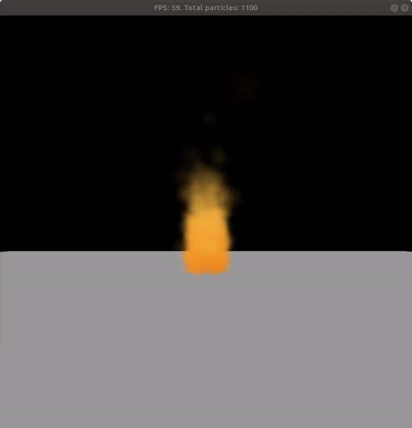

# Particle System

This project was created for a course I took at my university, CSCI 5611 - Animation and Planning in Games

## Water Simulation
* Real-time mouse interaction

## Fire Simulation

## Information
The project was written in Processing 3, using [QueasyCam](https://github.com/jrc03c/queasycam) for 3D camera navigation. `PVector` was not used, I implemented a custom vector library.